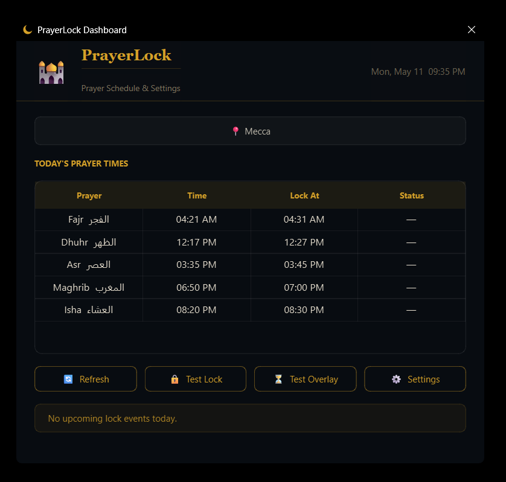
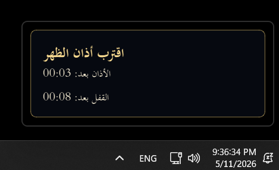

# PrayerLock

PrayerLock is a Windows application that reminds users before Athan and temporarily locks the computer during prayer time to encourage consistency and reduce distractions.

---

## Features

- Automatic location detection by IP
- Manual city or coordinates fallback
- Prayer times fetched from Aladhan API
- Offline prayer time calculation fallback
- Configurable reminder before Athan
- Always-on-top warning overlay before lock
- Fullscreen Arabic lock screen with:
  - Quran verse
  - Countdown timer
  - Prayer information
- Master password support:
  - Skip upcoming lock
  - Unlock early if needed
- System tray application with:
  - Today's prayer schedule
  - Test Overlay
  - Test Lock
  - Skip next lock
- Background Windows service for lock enforcement
- Starts automatically for all Windows users after installation

---

## Screenshots

### Main Application

<p align="center">
  
</p>

The main configuration window used to manage prayer timings, reminders, lock duration, and application settings.

---

### Warning Overlay

<p align="center">
  
</p>

A lightweight always-on-top overlay displayed shortly before the screen lock activates.

---

### Lock Screen

<p align="center">
  
</p>

The fullscreen prayer lock screen shown during prayer time, including countdown timer and unlock controls.

---

## Installation

1. Download `PrayerLock-Setup.exe`
2. Right-click the installer
3. Select **Run as administrator**
4. Complete the setup wizard
5. Configure:
   - City or location
   - Reminder timing
   - Lock timing
   - Master password
6. Leave the tray application running

After installation, you can test the application from the tray menu using:

- **Test Overlay**
- **Test Lock**

---

## Uninstall

Remove PrayerLock using:

```powershell
Settings > Apps > PrayerLock > Uninstall