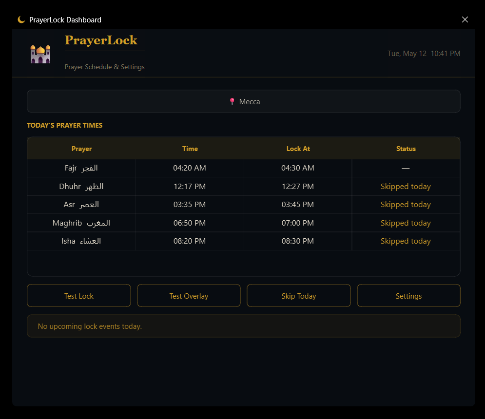

# PrayerLock

PrayerLock is a Windows app that reminds users before Athan and temporarily locks the computer during prayer time.

---

## Features

- Auto-selects country/city as a starting point, with manual correction if it is wrong
- Built-in Gulf and Middle East country/city list
- Prayer times from Aladhan, with offline `adhan` fallback
- Country-aware calculation method selection
- Configurable reminder before Athan
- Small always-on-top warning overlay
- Arabic lock screen with Quran verse and countdown
- Master password for:
  - unlocking early
  - skipping the next lock
  - skipping selected prayers for today
  - quitting the tray app
  - uninstalling
- Tray app with today's schedule, test overlay, test lock, and skip controls
- Windows service for background lock enforcement
- Starts automatically for all Windows users after installation

The password is not meant to be a real security feature. It is mainly for child enforcement and habit-building: helping the user stop games, calls, or work when it is time to pray.

---

## Screenshots

### Main Application

<p align="center">
  
</p>

The main configuration window used to manage prayer timings, reminders, lock duration, and application settings.

---

### Warning Overlay

<p align="center">
  
</p>

A lightweight always-on-top overlay displayed shortly before the screen lock activates.

---

### Lock Screen

<p align="center">
  
</p>

The fullscreen prayer lock screen shown during prayer time, including countdown timer and unlock controls.

---

## Installation

1. Download `PrayerLock-Setup.exe` under the installer folder in the repo.
2. Right-click the installer.
3. Select **Run as administrator**.
4. Complete the setup wizard.
5. Choose the country, city, reminder timing, lock timing, and master password.
6. Leave the tray app running.

After installation, use the tray menu to test:

- **Test Overlay**
- **Test Lock**

---

## Skipping Today

From the tray app, choose **Skip Specific Prayers Today**.

Select the prayers to skip, enter the master password, and PrayerLock will skip only those prayers for the rest of the day. The next day works normally again.

---

## Uninstall

Use:

```powershell
Settings > Apps > PrayerLock > Uninstall
```

The uninstaller asks for the master password.

---

## Build

```powershell
pip install -r requirements.txt
pyinstaller --clean PrayerLock.spec
iscc PrayerLock.iss
```

The installer is created at:

```text
installer\PrayerLock-Setup.exe
```
